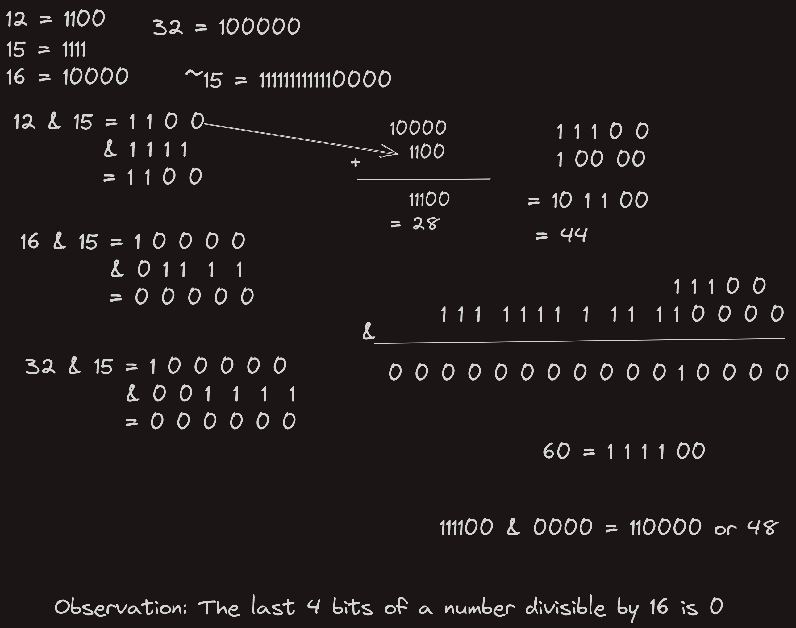

# Ensure memory alignment by bounds checking

There are fucntions to allocate memory ensuring proper alignment in C, such as `aligned_alloc()` avalaible in the standard library 
or `__builtin_aligned_alloc()` avalaible with *GNU standard C* library. But
it is possible to check the alignment of certain chunk of memory manually,
to ensure that it is easier for the **CPU** to read the chunk properly.

Suppose, you want to align a memory chunk by 16 bytes, you can use the code provided below:
```c
if (size & 0xFu) size = (size + 16) & (~(size_t)0xFu);
```

This code checks the provided chunk `size` is a multiple to 16, if it is not so, 
the size is adjusted to the next multiple of 16. This way, it is ensured that
memory is allocated in fixed chunks and also memory address starts at a specific
boundary, in this case a boundary multiple to 16.

The attached image should describe how the code actually does this with bitwise operations.
